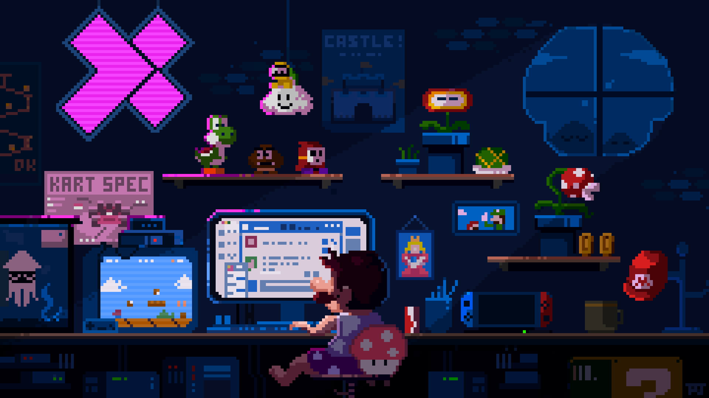

# Pixel video:

  

# 💫 About Me:
Hi, I’m Vishesh, a passionate Web Development student who loves building clean, responsive websites and learning new technologies and I am currently pursuing Artificial Intelligence & Machine Learning (AI/ML) and building a strong foundation in data, algorithms, and intelligent systems.. 🛠️ I’m currently working on Personal web projects HTML, CSS, JavaScript practice Small projects using Node.js & Express 🤝 I’m looking to collaborate on Beginner-friendly web development projects Open-source or college projects Frontend or MERN stack projects 🆘 I’m looking for help with Backend concepts Real-world project structure Deployment & GitHub best practices 🌱 I’m currently learning JavaScript (Advanced) React.js Git & GitHub Basics of AI/ML 💬 Ask me about HTML, CSS, JavaScript Node.js & Express basics Git vs GitHub Figma & WordPress basics ⚡ Fun fact I enjoy learning tech by building projects instead of just watching tutorials 😄 

## 🌐 Socials:
    

# 💻 Tech Stack:
                      

## 🐍 Contribution Snake

# 📊 GitHub Stats:
 
 

### ✍️ Random Dev Quote

---

<!-- Proudly created with GPRM ( https://gprm.itsvg.in ) -->
